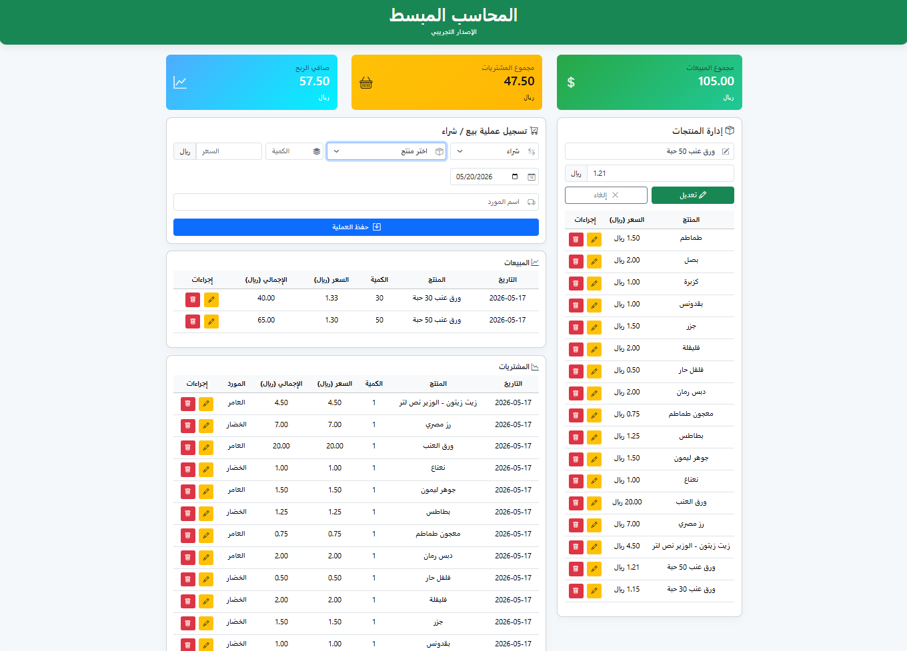

---

# 💼 المحاسب المبسط | Simple Accountant

نظام محاسبة مبسط وسهل الاستخدام يساعد أصحاب المشاريع الصغيرة على إدارة المبيعات والمشتريات والمنتجات بطريقة منظمة وسريعة.

A simple and lightweight accounting system designed to help small businesses manage sales, purchases, and products easily.

---

# 🚀 المميزات | Features

## 🇸🇦 المميزات العربية

* ➕ إضافة المنتجات بسهولة
* 🧾 تسجيل عمليات البيع والشراء
* 📊 حساب الأرباح بشكل تلقائي
* 💾 تخزين البيانات داخل المتصفح (IndexedDB)
* ✏️ تعديل وحذف العمليات بسهولة
* 📦 واجهة بسيطة وسهلة الاستخدام

## 🇬🇧 English Features

* ➕ Add products easily
* 🧾 Record sales and purchases
* 📊 Automatic profit calculation
* 💾 Store data locally using IndexedDB
* ✏️ Edit and delete transactions
* 📦 Simple and user-friendly interface

---

# 🖥️ صور المشروع | Screenshots

## 🏠 الصفحة الرئيسية | Dashboard



---

---
# 🚀 Live Demo | النسخة التجريبية
---

## 🇸🇦 Arabic 
🔗 **اضغط هنا لتجربة النظام**

👉 https://accounting-app-ochre-omega.vercel.app
---
# ⚙️ طريقة التشغيل | How to Run

## 🇸🇦 التشغيل

1. افتح مجلد المشروع
2. ثبّت الحزم:

```bash
npm install
````

3. شغّل المشروع:

```bash
npm run dev
```

أو استخدم:

* VS Code Live Server (في حال تشغيل نسخة static)
* أو افتح الرابط الذي يظهر في الطرفية

---

## 🇬🇧 Run Instructions

1. Open the project folder
2. Install dependencies:

```bash
npm install
```

3. Run the project:

```bash
npm run dev
```

Or use:

* VS Code Live Server (for static version)
* Or open the link shown in terminal
---

# 🧱 التقنيات المستخدمة | Tech Stack

## 🇸🇦 عربي

- ⚡ Vite (أداة بناء وتشغيل المشروع)
- 🧩 Vue.js (لبناء واجهة المستخدم التفاعلية)
- 🌐 HTML5 (هيكلة الصفحات)
- 🎨 CSS3 + Bootstrap (تصميم الواجهة)
- ⚙️ JavaScript (منطق التطبيق)
- 🗄️ IndexedDB (تخزين البيانات محليًا داخل المتصفح)
- 📦 LocalStorage (تخزين بيانات خفيفة وسريعة)
- 📧 EmailJS (إرسال الإيميلات)
- 🚀 Vercel (استضافة المشروع)

## 🇬🇧 English

- ⚡ Vite (Modern frontend build tool for fast development)
- 🧩 Vue.js (Progressive JavaScript framework for building UI)
- 🌐 HTML5 (Structure of web pages)
- 🎨 CSS3 + Bootstrap (Styling and responsive design)
- ⚙️ JavaScript (Core application logic)
- 🗄️ IndexedDB (Client-side database for storing structured data in the browser)
- 📦 LocalStorage (Simple key-value storage in the browser)
- 📧 EmailJS (Sending emails directly from the client-side)
- 🚀 Vercel (Deployment and hosting platform)

---

# 📁 هيكلة المشروع| Project Structur
````md
📦 accounting_app
│
├── 🌐 index.html
├── 🧾 accounting.html
├── ⚙️ vite.config.js
├── 📄 package.json
│
├── 📁 public/
│   ├── 🖼️ favicon.svg
│   ├── 🧩 icons.svg
│   ├── 🖼️ landing-preview.png
│   │
│   └── 📁 versions/
│       ├── 📄 versions.html
│       ├── 📁 css/
│       │   └── 🎨 versions.css
│       │
│       └── 📁 v1.0/
│           ├── 🌐 index.html
│           └── 🎨 style.css
│
├── 📁 src/
│   ├── 🚀 main.js
│   ├── 🧩 App.vue
│   │
│   ├── 📁 assets/
│   │   └── 🖼️ favicon.svg
│   │
│   ├── 📁 components/
│   │   └── 🧱 Home.vue
│   │
│   ├── 📁 css/
│   │   ├── 🎨 landing.css
│   │   └── 🎨 style.css
│   │
│   └── 📁 js/
│       ├── ⚙️ app.js
│       ├── 🗄️ db.js
│       ├── 📦 products.js
│       ├── 💰 transactions.js
│       ├── 🎛️ ui.js
│       ├── 🧠 utils.js
│       ├── 🪄 confirm-dialog.js
│       ├── ✏️ product-full-edit.js
│       ├── ⚡ product-quick-edit.js
│       ├── 💳 sale-full-edit.js
│       ├── 📊 transaction-full-edit.js
│       │
│       └── 📁 api/
│           └── 📧 email.js
│
├── 📸 screenshots/
│   └── 🖼️ index.png
│
└── 📦 node_modules/
````

---

# 👨‍💻 Developer | المطور

**alshagag**

---

# ⭐ Notes | ملاحظات

## 🇸🇦 عربي

* المشروع يعمل بدون قاعدة بيانات خارجية
* جميع البيانات محفوظة داخل المتصفح (LocalStorage / IndexedDB)
* مناسب للمشاريع الصغيرة والتجارب التعليمية

## 🇬🇧 English

* The project works without an external database
* All data is stored inside the browser (LocalStorage / IndexedDB)
* Suitable for small projects and educational purposes
